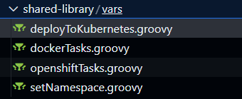
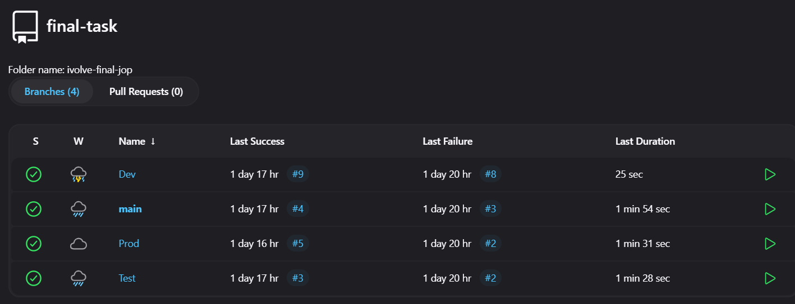

# MultiBranch Pipeline Project

## Overview
This project demonstrates how to automate application deployment to a Kubernetes cluster using a Jenkins Multibranch Pipeline. The deployment occurs in separate namespaces based on the branch name in the GitHub repository.

## Project Objectives
Create 3 namespaces in your Kubernetes environment:
- **dev** (Development namespace)
- **test** (Testing namespace)
- **prod** (Production namespace)

Configure a Multibranch Jenkins Pipeline that:
- Builds a Docker image from the source code.
- Pushes the image to DockerHub.
- Deploys the application to Kubernetes based on the branch name:
  - **dev** → Dev namespace
  - **test** → Test namespace
  - **main** or **prod** → Prod namespace

Set up a Jenkins Agent (slave) to execute the pipeline tasks.

## Pipeline Flow
The diagram below outlines the workflow:
![infra]](./Images/ar.png)
- Build the Docker image using the `Dockerfile` stored in GitHub.
- Push the Docker image to a DockerHub repository.
- Deploy the application to the Kubernetes cluster using namespaces based on the branch name.

## Requirements
Before starting, ensure the following tools and configurations are in place:

### Tools:
- Kubernetes Cluster (Minikube, OpenShift, or Cloud-managed K8s) in this task i use AKS as Kubernetes cluster.
- Jenkins with Multibranch Pipeline plugin installed.
- Docker and DockerHub account.
- GitHub repository with a Dockerfile and deployment YAML files.
- Jenkins Agent configured to run on a separate node (slave).

### Kubernetes Namespaces
Create the following namespaces in your Kubernetes cluster:

```bash
kubectl create namespace Dev
kubectl create namespace Test
kubectl create namespace Prod
```

## Jenkins Pipeline Configuration
Create a `Jenkinsfile` in your repository to define the pipeline:

```groovy
@Library("shared-library@main") _  // Import the shared library

pipeline {
    agent { label 'slave01' }

    environment {
        DOCKER_IMAGE_NAME = 'ivolve'
        DOCKER_HUB_REPO = 'ahmedmahmood44'
        DOCKER_HUB_CREDENTIALS = credentials('Docker')
        NAMESPACE = ""
    }

    stages {
        stage('Set Namespace') {
            steps {
                script {
                    // Get the appropriate namespace based on the branch name
                    NAMESPACE = setNamespace(env.BRANCH_NAME)
                    echo "Deploying to namespace: ${NAMESPACE}"
                }
            }
        }
        
        stage('Checkout Code') {
            steps {
                echo "Checking out code from SCM..."
                checkout scm
            }
        }

        stage('Build Docker Image') {
            steps {
                script {
                    dockerTasks.buildDockerImage(DOCKER_IMAGE_NAME, env.BUILD_NUMBER)
                }
            }
        }

        stage('Docker Login') {
            steps {
                script {
                    dockerTasks.dockerLogin(DOCKER_HUB_CREDENTIALS_USR, DOCKER_HUB_CREDENTIALS_PSW)
                }
            }
        }

        stage('Push to Docker Hub') {
            steps {
                script {
                    dockerTasks.pushDockerImage(DOCKER_IMAGE_NAME, env.BUILD_NUMBER, DOCKER_HUB_REPO)
                }
            }
        }

        stage('Deploy to Kubernetes') {
            steps {
                script {
                    // Deploy to Kubernetes using the shared library
                    deployToKubernetes(NAMESPACE)
                }
            }
        }
    }

    post {
        always {
            echo "Cleaning up Docker resources..."
            script {
                dockerTasks.dockerCleanup()
            }
        }
        success {
            echo "Pipeline executed successfully!"
        }
        failure {
            echo "Pipeline failed. Check the logs for more details."
        }
    }
}
```

## Shared Library Configuration
Create shared library functions for:
- `setNamespace` (maps branch name to namespaces)
- Docker tasks (`build`, `push`, and `login`)
- Deployment tasks (`deployToKubernetes`).

```groovy
// vars/setNamespace.groovy

def call(String branchName) {
    def namespace = ""

    if (branchName.contains("Dev")) {
        namespace = "dev"
    } else if (branchName.contains("Test")) {
        namespace = "test"
    } else if (branchName == "main" || branchName.contains("Prod")) {
        namespace = "prod"
    } else {
        error "Branch name '${branchName}' does not match any known namespace"
    }
    
    echo "Deploying to namespace: ${namespace}"
    return namespace
}
```
```groovy
// vars/dockerTasks.groovy
def buildDockerImage(String imageName, String buildNumber) {
    echo "Building Docker image: ${imageName}:${buildNumber}..."
    sh """
        docker build -t ${imageName}:${buildNumber} .

    """
}

def dockerLogin(String username, String password) {
    echo "Logging in to Docker Hub..."
    sh """
        echo "${password}" | docker login -u "${username}" --password-stdin

    """
}

def pushDockerImage(String imageName, String buildNumber, String repoName) {
    echo "Tagging and pushing Docker image to Docker Hub..."
    sh """
        docker tag ${imageName}:${buildNumber} ${repoName}/${imageName}:latest
        docker push ${repoName}/${imageName}:latest

    """
}

def dockerCleanup() {
    echo "Cleaning up Docker images..."
    sh """
        docker logout
        docker image prune -f
        
    """
}

```
```groovy
// vars/deployToKubernetes.groovy

def call(String namespace) {
    // Use credentials to fetch the Kubernetes kubeconfig
    withCredentials([file(credentialsId: 'aks', variable: 'KUBECONFIG')]) {
        // Deploy to Kubernetes using the provided namespace
        sh """
            export KUBECONFIG=${KUBECONFIG}
            kubectl apply -f deployment.yaml --namespace=${namespace}
            kubectl get pods --namespace=${namespace}
        """
    }
}

```


## Deployment Steps

### 1. Clone your GitHub repository:

```bash
git clone https://github.com/Ahmed-Jim1/multibranch-task.git this the multibrach project. 
```

### 2. Commit and push the Jenkinsfile:
Push the `Jenkinsfile` to your GitHub repository under the desired branches (e.g., dev, test, main).

### 3. Configure the Jenkins Multibranch Pipeline:
- Create a new Jenkins job.
- Select **Multibranch Pipeline**.
- Add your GitHub repository URL.
- Configure credentials for accessing the repository.

### 4. Run the pipeline:
Jenkins will automatically discover branches (**dev**, **test**, **main**).
The pipeline will execute based on the branch name and deploy to the appropriate Kubernetes namespace.

### 5. Verify the deployment:
Use the following commands to confirm that the application is deployed:

```bash
kubectl get pods -n <namespace>
kubectl get services -n <namespace>
```

## Pipeline Workflow Summary
- **dev branch** → Deploys to **Dev** namespace.
- **test branch** → Deploys to **Test** namespace.
- **main/prod branch** → Deploys to **Prod** namespace.

## Results
By the end of this project:
- Jenkins Multibranch Pipeline will automate deployment to Kubernetes namespaces based on GitHub branches.
- Docker images will be built, pushed to DockerHub, and deployed seamlessly.



## Cleanup
To clean up resources, delete namespaces:

```bash
kubectl delete namespace Dev
kubectl delete namespace Test
kubectl delete namespace Prod
```


## Conclusion
This project demonstrates a CI/CD pipeline with Jenkins, Kubernetes, and DockerHub. The pipeline automates the process of building, pushing, and deploying applications across different environments.
