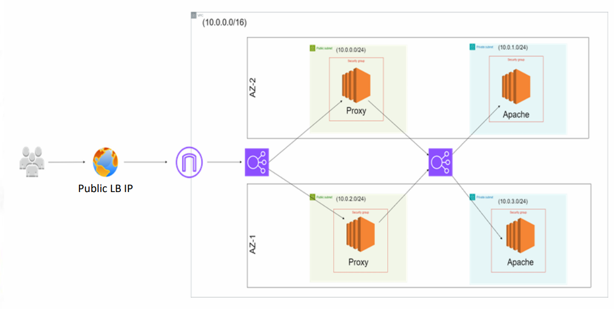
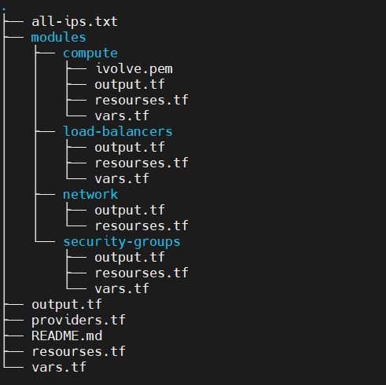
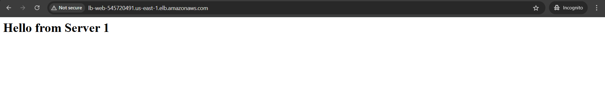
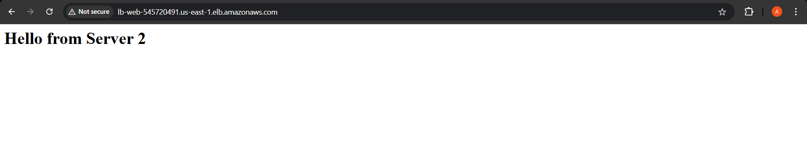
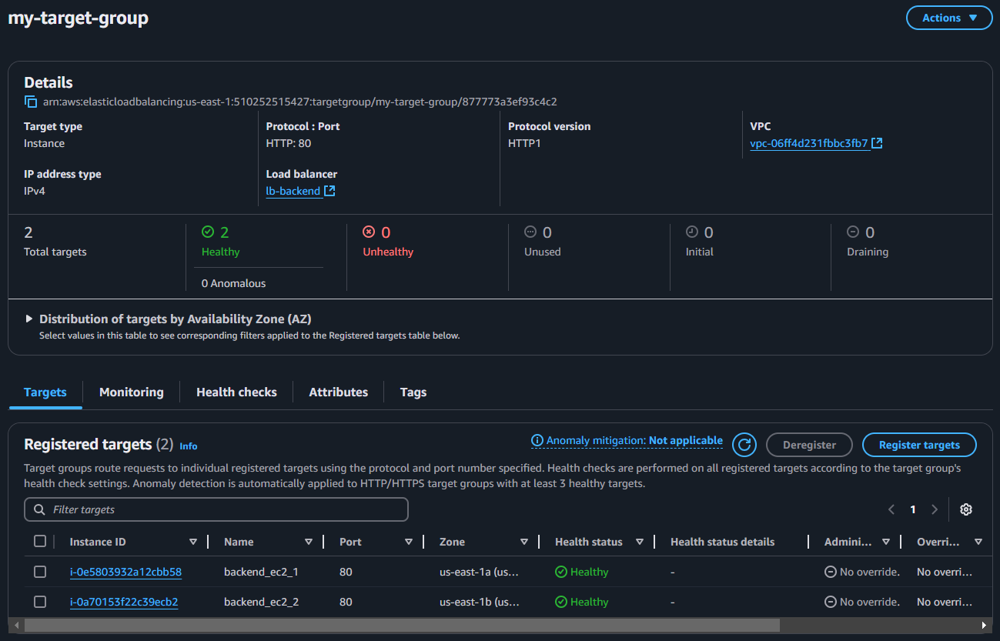
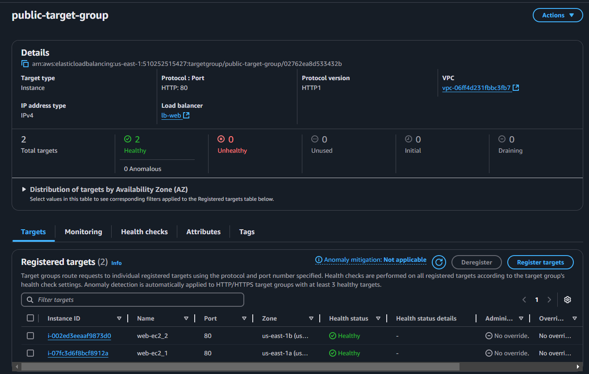

# Terraform Task 5: Multi-AZ Infrastructure with Load Balancer

## **Task Description**
This project provisions a **multi-AZ infrastructure** using Terraform workspaces and modules, as outlined in the following diagram.

### **Objective**
1. Create a new Terraform workspace named **`ivolve`**.
2. Implement the architecture using Terraform **modules**.
3. Output the **Public Load Balancer (LB) IP**.
4. Provide screenshots showing successful access to the Public LB IP.

---

## **Architecture Diagram**


The infrastructure includes:
- **VPC** with CIDR block `10.0.0.0/16`.
- **2 Public Subnets** for Proxy servers in **AZ-1** and **AZ-2**.
- **2 Private Subnets** for Apache servers in **AZ-1** and **AZ-2**. 
- **Application Load Balancer (ALB)** routing requests to Proxy servers, which forward traffic to Apache servers.
- **Security Groups** to manage access control.

---

## **Project Structure**



---
## **Steps to Provision the Infrastructure**

1. **Install Terraform**
   Make sure Terraform is installed on your machine. Verify with:
   ```bash
   terraform --version
   ```

2. **Set Up Terraform Workspace**
   Create a new workspace named `ivolve`:
   ```bash
   terraform workspace new ivolve
   ```

3. **Initialize Terraform**
   Initialize the Terraform project:
   ```bash
   terraform init
   ```

4. **Apply Terraform Configuration**
   Deploy the infrastructure:
   ```bash
   terraform apply -auto-approve
   ```

5. **Output the Public LB IP**
   After applying, retrieve the Public Load Balancer IP:
   ```bash
   terraform output public_lb_ip
   ```

---

## **Outputs**
- **Public Load Balancer IP**: The IP or DNS name of the Load Balancer.
- **Screenshots**: 
   - Screenshot showing successful access to the **Public LB IP** in a browser.
   - Example below:
   
   


---

## **Key Features**
- **Reusable Modules**: Code is modularized into:
   - VPC module
   - EC2 module
   - Security Group (SG) module
   - Load Balancer (ALB) module
- **No Code Duplication**: Code is parameterized to avoid repetition.
- **Workspace Isolation**: Terraform workspaces are used to isolate environments.

---

## **Clean Up**
To destroy the infrastructure and avoid extra charges:
```bash
terraform destroy -auto-approve
```

---

## **Requirements**
- Terraform >= 1.0
- AWS CLI configured with proper credentials.
- Access to an AWS account.

---

## **Screenshots**
1. Public Load Balancer Target-Group is Healthy:
   
2.   
     

---
